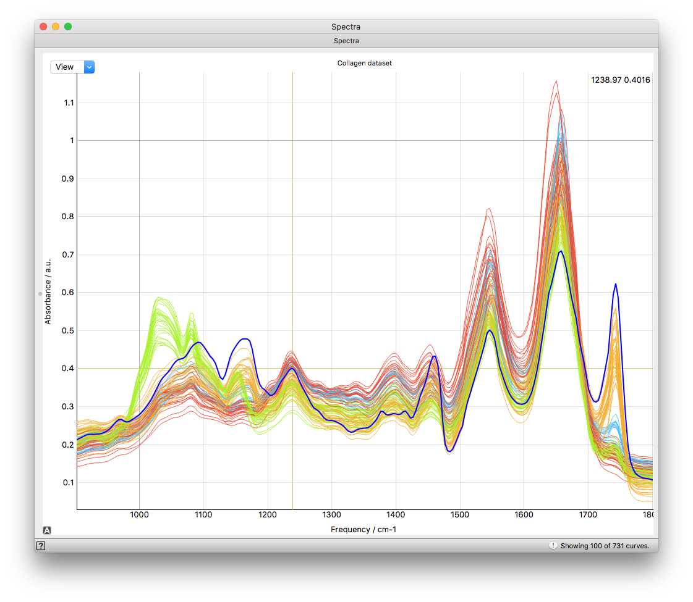
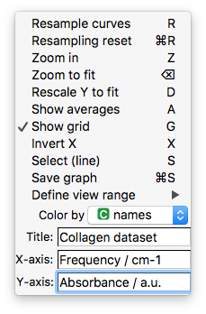

=======
Spectra
=======

.. image:: icons/mywidget.png

A widget to visually explore series of spectra with no spatial information.

Signals
-------

- Data

- Data subset

**Outputs**:

- Selection

Description
-----------

The Spectra widget allows quick visual exploration of multiple spectra. The X and Y position of the cross-hair cursor
is displayed in real time in the top-right corner. The spectrum which the mouse points at is plotted with a thick blue
line. This spectrum can be selected (the line changes to a thick dashed line) and multiple selections can be done with
the pressing the modifier key dependent on the operating system default. Selected spectra are sent to the output of the
widget and are available for further manipulation and processing.

The ESC key closes the widget. Parameters are saved, so the view will be the same when the widget is reopened.

The graph can be exported in PNG format.

Mouse behavior
--------------
**Left-click + drag:** move plotting canvas

**Right-click:** zoom to fit

**Right-click + drag:** free zoom (horizontal movement zooms X axis, vertical movement zooms Y axis)

**Scroll:** zoom X axis with the center position of the current mouse position

**Scroll + modifier key:** zoom Y axis with the center position of the current mouse position

Quick Menu items
----------------

The plot area is customizable from the quick menu in the top-left corner. Keyboard shortcuts are shown at the end of
each menu item where available.

**Resample curves** or **"R"**

    At any given time 100 spectra are randomly selected from the full dataset and are shown in the plot area. The random sample can be regenerated with this menu item or by pressing **"R"** while the Spectra widget is active.

**Resampling reset** or **"mod + R"**

    In order to enable repeatable visualizations the random sample sequences are saved and it is possible to show the initial position with this function or the **modifier + "R"** shortcut.

**Zoom in** or **"Z"**

    Rectangular zoom. After activation (through the menu or the **"Z"** shortcut) the mouse cursor changes to a cross-hair. The first click defines one corner of a rectangle. The second click defines the opposite corner and zooms in.

**Zoom to fit** or **backspace**, same as **right-click**

    Zoom to fit all data in the window.

**Rescale Y to fit** or **"D"**

    Rescales the Y axis so all data is visible.

**Show averages** or **"A"**

    Shows the mean spectrum with a thick line and a 1 STD shaded area on each side of the mean instead of individual spectra. If classes are available and the class based coloring is selected each class average is calculated and plotted with their respective STD below and above the mean.

**Show grid** or **"G"**

    Displays a grid on the plot area in grey to allow easier visual inspection of values.

**Select (line)** or **"S"**

    Line selection tool. The mouse pointer changes to a cross-hair and the first click defines the starting point of a line shown with a thick black dashed line. The second click selects all spectra which are crossed by the drawn line (also those not visible). The selected and visible spectra will change to a thick dashed line.

**Save Graph** or **"modifier + S"**

    Exports the graph in PNG format.

**Define view range**

    Allows for manual input of axes limits.

**Color by**

    Spectra can be colored by meta-attributes, such as classes.

**Title**

    Adds a title to the plotting area.

**X-axis**

    X-axis label.

**Y-axis**

    Y-axis label.