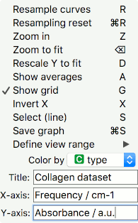

Spectra
=======

Visually explore series of spectra with no spatial information.

Inputs
    Data
        input dataset
    Data Subset
        subset of the data

Outputs
    Selection
        selected spectra

The **Spectra** widget allows quick visual exploration of multiple spectra. The X and Y position of the cross-hair cursor is displayed in real time in the top-right corner. The spectrum which the mouse points at is plotted with a thick blue line. This spectrum can be selected (the line changes to a thick dashed line) and multiple selections can be done by pressing the modifier key (Ctrl or Cmd). Selected spectra are sent to the output of the widget and are available for further manipulation and processing.

.. figure:: images/Spectra-stamped.png

1. Plot options menu with keyboard shortcuts:
   - Resample curves (R): only a subset of the spectra is displayed for better performance. Use *Resample curves* to resample.
   - Resampling reset (Mod + R): resample to the first view you've seen (seed 0)
   - Zoom in (Z): zoom to a region. When the option is selected, draw the area you wish to observe closely and the plot will zoom into it.
   - Zoom to fit (Backspace): return to the original plot
   - Rescale Y to fit (D): when an area of the spectra is selected, you can rescale the Y axis to fit the screen.
   - Show averages (A): show the average of spectra with 1 standard deviation per wavenumber. If the plot uses coloring, averages will be displayed per each color.
   - Show grid (G): show the grid for a better inspection of the plot.
   - Invert X (X): invert the order of the X axis (from min to max or the other way around).
   - Select (line) (S): click on the top left corner of the area you wish to select, then click on the lower right. You will see the line going across the spectra - these are the spectra you have selected. They will appear as a dashed line in the plot.
   - Save graph (Mod + S): save the visualization as a .png, .svg or .pdf file.
   - Define view range: define cutoffs to see a specific range of the plot.
   - Color by: use any discrete attribute for coloring the spectra.
   - Title: give your plot a title
   - X-axis: rename the X axis
   - Y-axis: rename the Y axis
2. The plot shows a sample of the spectra. At the top right corner, you can see the X and Y position of the mouse cursor and the legend, if you have seleced *Color by*.

The ESC key closes the widget. Parameters are saved, so the view will be the same when the widget is reopened. The graph can be exported in PNG format.

Example
-------

The **Spectra** widget is used to visualize spectral data. X axis normally shows wavenumbers, while the Y axis shows the absorbance. We will plot the *Liver spectroscopy* data from the **Datasets** widget as an example.

We have used *Color by* option to display the type of each spectrum. Or you can also press 'C' and the plot will show colors.

Now, let's say I am interested in those spectra, that are quite separated from the rest at wavenumber around 1027. I will press 'S', click once where I want my selection to start and once where I want it to end. This will select the spectra under the line I have dragged.

I can observe the selection in another **Spectra** widget or use it for further analysis.

.. figure:: images/Spectra-Example1.png

Mouse behavior
--------------

**Left-click + drag:** move the plot

**Right-click:** zoom to fit

**Right-click + drag:** free zoom (horizontal movement zooms X axis, vertical movement zooms Y axis)

**Scroll:** zoom X axis with the center position of the current mouse position

**Scroll + modifier key:** zoom Y axis with the center position of the current mouse position

Quick Menu items
----------------

The plot area is customizable from the quick menu in the top-left corner. Keyboard shortcuts are shown at the end of each menu item where available.

**Resample curves** or **"R"**

    At any given time a 100 spectra are randomly selected from the full dataset and shown in the plot area. The random sample can be regenerated with this menu item or by pressing **"R"** while the Spectra widget is active.

**Resampling reset** or **"mod + R"**

    In order to enable repeatable visualizations the random sample sequences are saved and it is possible to show the initial position with this function or the **modifier + "R"** shortcut.

**Zoom in** or **"Z"**

    Rectangular zoom. After activation (through the menu or the **"Z"** shortcut) the mouse cursor changes to a cross-hair. The first click defines one corner of a rectangle. The second click defines the opposite corner and zooms in.

**Zoom to fit** or **backspace**, same as **right-click**

    Zoom to fit all the data in the window.

**Rescale Y to fit** or **"D"**

    Rescales the Y axis so that all the data is visible.

**Show averages** or **"A"**

    Shows the mean spectrum with a thick line and a 1 STD shaded area on each side of the mean instead of individual spectra. If classes are available and the class based coloring is selected, each class average is calculated and plotted with their respective STD below and above the mean.

**Show grid** or **"G"**

    Displays a grid on the plot area in grey to allow easier visual inspection of values.

**Select (line)** or **"S"**

    Line selection tool. The mouse pointer changes to a cross-hair and the first click defines the starting point of the line shown with a thick black dashed line. The second click selects all the spectra which are crossed by the drawn line (also those not visible). The selected and visible spectra will change to a thick dashed line.

**Save Graph** or **"modifier + S"**

    Exports the graph in PNG format.

**Define view range**

    Allows for manual input of axes' limits.

**Color by**

    Spectra can be colored by meta or class attributes.

**Title**

    Adds a title to the plotting area.

**X-axis**

    X-axis label.

**Y-axis**

    Y-axis label.
